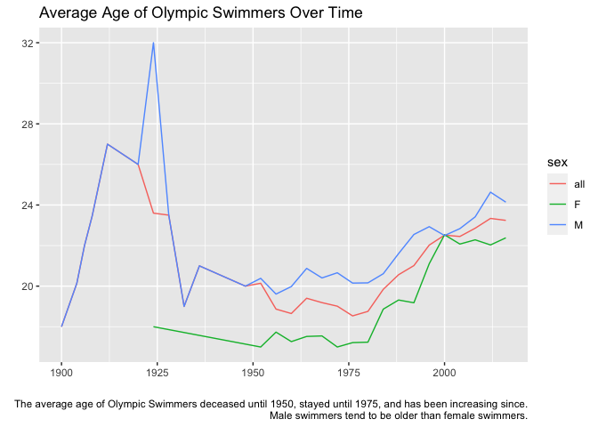

## 1) Data visualization: flights at ABIA

## 2) Wrangling the Billboard Top 100

Part A: Table of the top 10 most popular songs since 1958

    ## # A tibble: 10 × 3
    ##    song                              performer                             count
    ##    <chr>                             <chr>                                 <int>
    ##  1 Radioactive                       Imagine Dragons                          87
    ##  2 Sail                              AWOLNATION                               79
    ##  3 Blinding Lights                   The Weeknd                               76
    ##  4 I'm Yours                         Jason Mraz                               76
    ##  5 How Do I Live                     LeAnn Rimes                              69
    ##  6 Counting Stars                    OneRepublic                              68
    ##  7 Party Rock Anthem                 LMFAO Featuring Lauren Bennett & Goo…    68
    ##  8 Foolish Games/You Were Meant For… Jewel                                    65
    ##  9 Rolling In The Deep               Adele                                    65
    ## 10 Before He Cheats                  Carrie Underwood                         64

Part B
 Part
C 

## 3) Wrangling the Olympics

1.  

The 95th percentile of heights for female competitors across all
Athletics events is 183.

1.  

Rowing Women’s Coxed Fours has had the greatest variability in
competitor’s heights across the entire history of the Olympics.

1.  

## 4) K-nearest neighbors

### 350

The optimal value of k in this case is 8.

### 63 AMG

The optimal value of k in this case is 74.

63 AMG yields a larger optimal value of K, 26 compared to 8 for 350. I
suspect that it might be because there are a lot of 63AMGs with very low
mileage.
