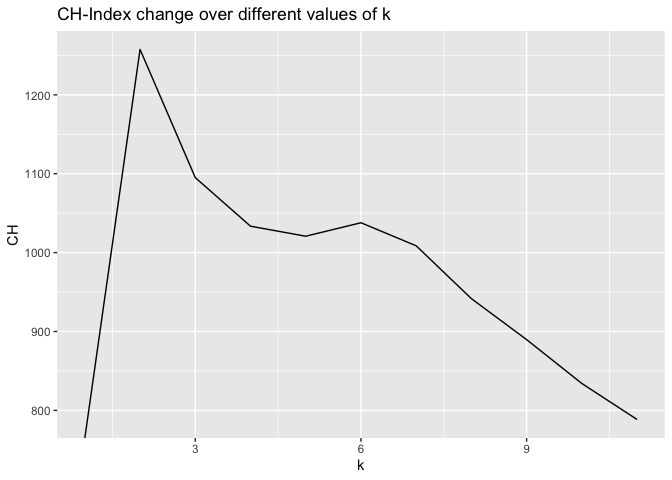
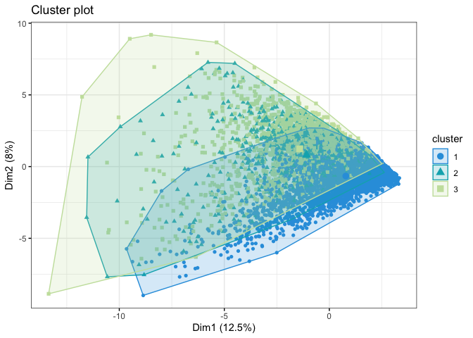
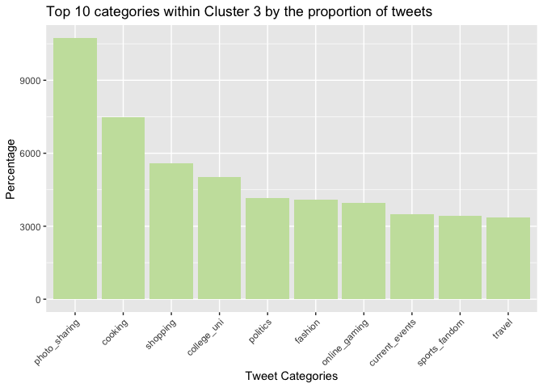
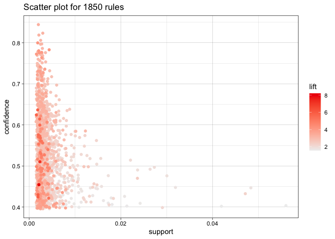

## Clustering and PCA

We first ran PCA on those 11 chemical properties.

From the first graph, we can see that red and white wines sort of form
clusters. This suggests that even after applying PCA, clustering would
be useful. The second graph says that the qualities are kind of all over
places, not easy to find a pattern.

I first picked the model of 2 clusters to see if it would naturally form
two clusters of red and white wines. The first graph represents how the
two clusters are formed with the color and quality, it looks like one
cluster has red wine and the other has white wine, across all qualities.

Next, I picked the model of 4 clusters, hoping to see four groups of
wine, low/high qualities and red/wine. The second graph represents the 4
clusters across different colors and qualities of wine. I can’t really
find a set pattern for the groups I was hoping to find.

I then went ahead to graph the clusters on the PCA axes, having the
shape denote the color/quality. We can see how useful the clusters are
to explain the colors but not so much for the qualities. That is, almost
all points belong to one color of wine in the first graph, whereas there
are many points that are in different clusters with the same quality.

## Market Segmentation

Let’s get some useful information about the market. In this code snippet
we are checking which are the top 5 popular tweet categories.

|                  | Total |
|:-----------------|------:|
| chatter          | 34671 |
| photo_sharing    | 21256 |
| health_nutrition | 20235 |
| cooking          | 15750 |
| politics         | 14098 |
| sports_fandom    | 12564 |

Ignoring chatter since it doesn’t belong to any single category.
`Photo sharing`, `health_nutrition`, `cooking`, `politics`,
`sports_fandom` are the top 4 popular tweet categories in the dataset.

Let’s try to run a standard PCA algoritm on the data.

The standard PCA doesn’t really help in this case because we are not
looking into a specific category of tweet. But grouping them into
clusters along with this graph can show us the categories that are
grouped together.

Let’s do a hierarchical clustering model and see if we can group the
categories together to get a more idea about the broader market
segments.

The cluster dendogram which uses the euclidean distance and the average
distance to group doesn’t give us any information about the marget
segments in general.

Now let’s perform k-means clustering which I think coupled with the PCA
methods will give a meaningful market segments. First step is to find
the optimal value for k that we should use in the `kmeans` method. For
each value of `k`, calculate the `withiness`, `betweeness` and
`CH-Index` from these values. This can help us get the optimal value of
`k`.

We decided to go with `k=3`. I think the improvement stops after `k=3`.

This plot shows how the clusters divide the PCA plot and looks like each
of these graphs have different categories. let’s analyze more on that.
We start by selecting the k-means cluster and grouping them by the
cluster and calculate the sum of the number of tweets. Also remove the
`cluster`, `chatter`, and `uncategorized` as they are not a part of any
specific market segment.

Let’s plot the top 5 categories suggested by each of the clusters used
in k-means.

Each clusters give us interesting results,

-   `Cluster1` - All the top 10 categories shown in the graph share
    similar percentage of the number of tweets between 4-6%. This
    category looks like representative of topics related to or covered
    in traditional mass media.
-   `Cluster2` - `photo_sharing`, `cooking`, `shopping`, and
    `college_uni` are the top 4 categories from this market category. I
    think this is representative of the young adults and college
    students because people generally associate those activities with
    the young adults.
-   `Cluster3` - `health_nutrition`, `personal_fitness` and `cooking`
    form separate market segment. This looks like a separate market
    segment where `health` is important.

We also see a lot of overlaps in the tweet categories between the
different clusters which is expected but `k-means` manages to extract
some useful information about the “market categories” of people using
the `NutrientH20` product. Based on this we suggest that they target
three distinct groups of **General Public / Traditional Mass Media /
Current Politics and News**, **Young Adults / **, and **Personal Fitness
/ Healthy Lifestyles**.

## Association rules for grocery purchase

As the average number of items in groceries list is 4.41, I chose the
`maxlen` to be 4. Also, since there are so many items, I chose a low
support of .002 as the threshold, with confidence equal to .4. With
higher support I did not get many rules. Plus, I thought if someone buys
something after putting another thing in the shopping cart with
probability of 0.4, it’s pretty meaningful. The table below shows the
rules with lift higher than 4 out of all the rules with the parameters I
specified.

|        | lhs                                               |     | rhs                |   support | confidence |  coverage |     lift | count |
|:-------|:--------------------------------------------------|:----|:-------------------|----------:|-----------:|----------:|---------:|------:|
| \[1\]  | {liquor}                                          | =>  | {bottled beer}     | 0.0046772 |  0.4220183 | 0.0110829 | 5.240594 |    46 |
| \[2\]  | {herbs, other vegetables}                         | =>  | {root vegetables}  | 0.0038638 |  0.5000000 | 0.0077275 | 4.587220 |    38 |
| \[3\]  | {herbs, whole milk}                               | =>  | {root vegetables}  | 0.0041688 |  0.5394737 | 0.0077275 | 4.949369 |    41 |
| \[4\]  | {chicken, citrus fruit}                           | =>  | {root vegetables}  | 0.0030503 |  0.4411765 | 0.0069141 | 4.047547 |    30 |
| \[5\]  | {beef, citrus fruit}                              | =>  | {root vegetables}  | 0.0038638 |  0.4578313 | 0.0084392 | 4.200346 |    38 |
| \[6\]  | {beef, tropical fruit}                            | =>  | {root vegetables}  | 0.0037621 |  0.4933333 | 0.0076258 | 4.526057 |    37 |
| \[7\]  | {beef, soda}                                      | =>  | {root vegetables}  | 0.0039654 |  0.4875000 | 0.0081342 | 4.472540 |    39 |
| \[8\]  | {onions, other vegetables, whole milk}            | =>  | {root vegetables}  | 0.0032537 |  0.4923077 | 0.0066090 | 4.516648 |    32 |
| \[9\]  | {curd, tropical fruit, whole milk}                | =>  | {yogurt}           | 0.0039654 |  0.6093750 | 0.0065074 | 4.368224 |    39 |
| \[10\] | {butter, other vegetables, yogurt}                | =>  | {tropical fruit}   | 0.0030503 |  0.4761905 | 0.0064057 | 4.538114 |    30 |
| \[11\] | {other vegetables, pip fruit, yogurt}             | =>  | {tropical fruit}   | 0.0035587 |  0.4375000 | 0.0081342 | 4.169392 |    35 |
| \[12\] | {citrus fruit, root vegetables, tropical fruit}   | =>  | {other vegetables} | 0.0044738 |  0.7857143 | 0.0056940 | 4.060694 |    44 |
| \[13\] | {citrus fruit, other vegetables, tropical fruit}  | =>  | {root vegetables}  | 0.0044738 |  0.4943820 | 0.0090493 | 4.535678 |    44 |
| \[14\] | {citrus fruit, other vegetables, root vegetables} | =>  | {tropical fruit}   | 0.0044738 |  0.4313725 | 0.0103711 | 4.110997 |    44 |
| \[15\] | {citrus fruit, other vegetables, whole milk}      | =>  | {root vegetables}  | 0.0057956 |  0.4453125 | 0.0130147 | 4.085493 |    57 |
| \[16\] | {other vegetables, rolls/buns, tropical fruit}    | =>  | {root vegetables}  | 0.0035587 |  0.4545455 | 0.0078292 | 4.170200 |    35 |

It’s interesting to see that if a person buys `liquor`, that person is
likely to buy `bottled beer` as well, which makes a lot of sense. There
are many rules with `root vegetables` on the right hand side.

From these three graphs, we can see that the majority of rules have
support less than 0.01. Another interesting fact is that a lot of rules
have the order of three or four. They tend to have lower support as
well, which is probably because it’s not likely to have that specific
combination in a shopping cart.

I then plotted top 70 rules by lift.

We can see the highest lift rule of `liquor` → `bottled beer`.
`root vegetables` and `other vegetables` have very big circles.

The graph below shows top 30 rules by lift.

