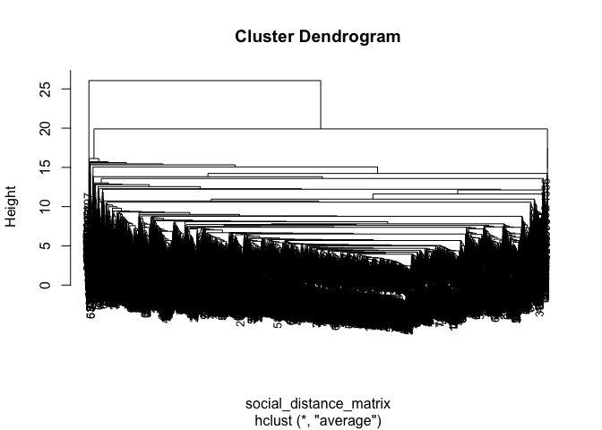

## Clustering and PCA

We first ran PCA on those 11 chemical properties.

From the first graph, we can see that red and white wines sort of form
clusters. This suggests that even after applying PCA, clustering would
be useful. The second graph says that the qualities are kind of all over
places, not easy to find a pattern.

I first picked the model of 2 clusters to see if it would naturally form
two clusters of red and white wines. The first graph represents how the
two clusters are formed with the color and quality, it looks like one
cluster has red wine and the other has white wine, across all qualities.

Next, I picked the model of 4 clusters, hoping to see four groups of
wine, low/high qualities and red/wine. The second graph represents the 4
clusters across different colors and qualities of wine. I can’t really
find a set pattern for the groups I was hoping to find.

I then went ahead to graph the clusters on the PCA axes, having the
shape denote the color/quality. We can see how useful the clusters are
to explain the colors but not so much for the qualities. That is, almost
all points belong to one color of wine in the first graph, whereas there
are many points that are in different clusters with the same quality.

## Market Segmentation

## Association rules for grocery purchase

Chose the confidence and the support cutoff levels so that the subset
have around 25 rows.
