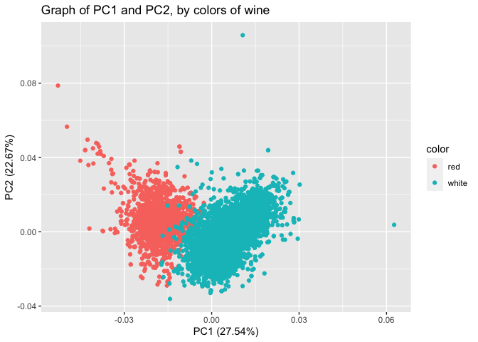
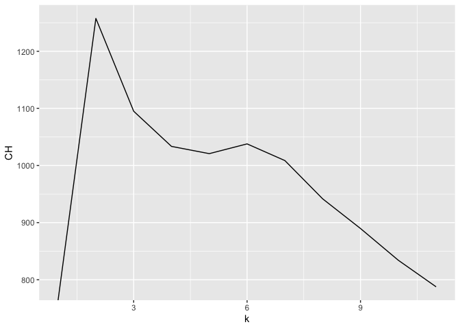
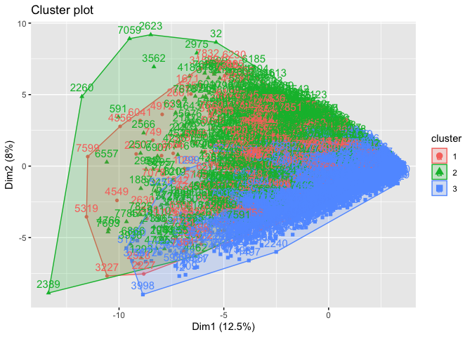
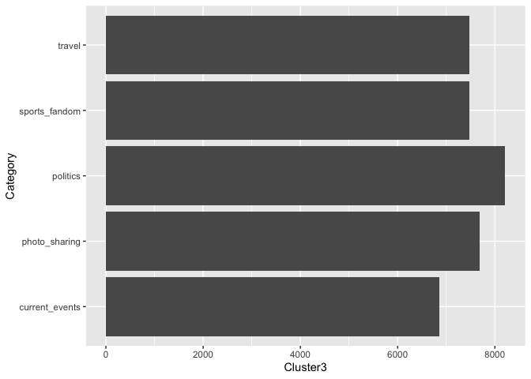
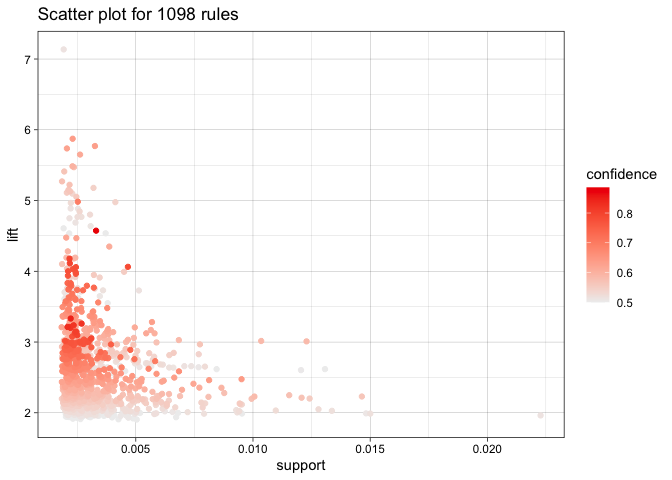

## Clustering and PCA

We first ran PCA on those 11 chemical properties.

From the first graph, we can see that red and white wines have pretty
different principal components. That is, we can easily distinguish

## Market Segmentation

## Association rules for grocery purchase

Chose the confidence and the support cutoff levels so that the subset
have around 25 rows.
